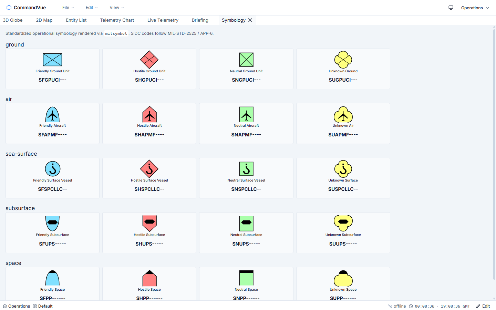
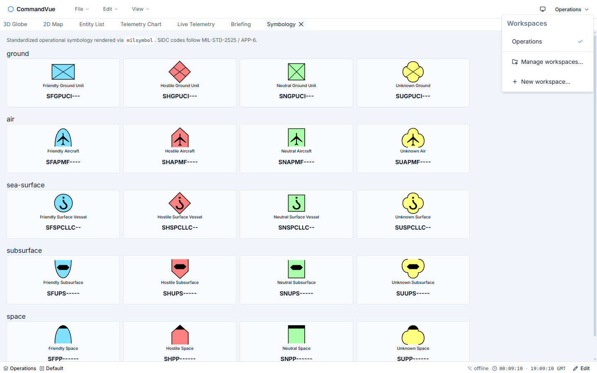
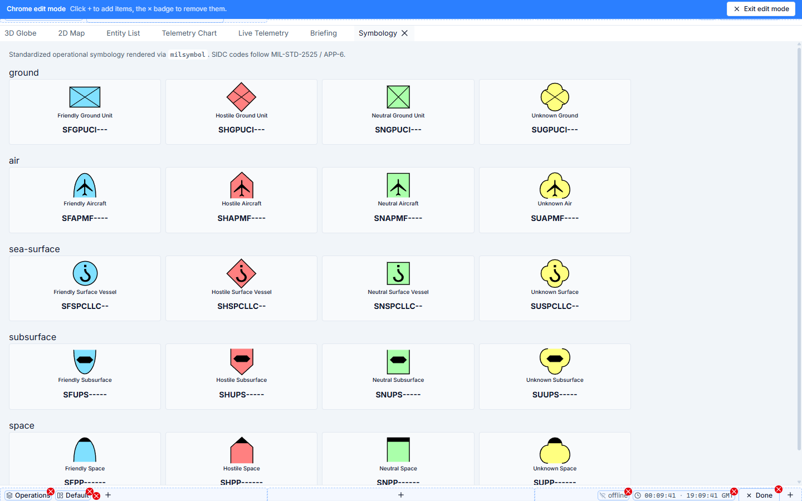

# Concepts — how CommandVue is organized

This page walks through CommandVue's five core concepts and how they fit together. Read top to bottom — each section builds on the previous.

If you're an engineer extending the template, follow the deeper references at the end of each section. If you're a user trying to make sense of the UI, the prose alone should give you the model.



The numbered elements above:

1. **App icon** (top-left) — left-click to focus, right-click for the global File / Edit / View menu (always available, even when the menu bar is hidden).
2. **Menu bar** — File / Edit / View. Same actions as the app-icon context menu; visible by default.
3. **Tab strip** — one tab per panel inside the active layout. Drag tabs to re-arrange or split the dock.
4. **Panel content** — the body of the currently focused tab (here, the Symbology browser).
5. **Theme toggle** (top-right, next to the workspace switcher) — cycles Light → Dark → Auto.
6. **Workspace switcher** — name of the active workspace + dropdown to switch between them.
7. **Status bar** (bottom) — current workspace + layout + unsaved-changes indicator + clock + chrome edit-mode toggle.

## 1. Workspaces

A **workspace** is the user's top-level container. Think of it as a saved view of "what should the dashboard look like right now" — a set of layouts plus the chrome arrangement, the active presets, and any per-workspace overrides.

Most users have one workspace ("Operations" is seeded on first launch) and never create another. Power users might have one workspace per mission, per shift, or per environment (training vs. live).



**Switch workspace:** top-right dropdown.
**Manage / rename / delete / import / export:** `Manage workspaces…` in the dropdown, or via `File → Import Workspace…` / `File → Export Workspace…`.
**Create new:** `+ New workspace…` in the dropdown.

One workspace is the **global default** (it loads first). Each workspace has its **own default layout** (the one that opens when you switch into the workspace).

Workspaces persist locally in IndexedDB. The Supabase-migration path under `docs/supabase-migration.md` documents how they cascade to the server in deployments that have one.

## 2. Layouts

A **layout** is one specific arrangement of panels inside a workspace. Drag tabs to split the dock; that's a layout. Save it; that's a named layout.

Each workspace contains one or more layouts. The seeded "Default" layout has all seven panels arranged in a fixed grid. Save your own arrangement via:

- **File → Save Layout** (`Ctrl+S`) — overwrites the current layout
- **File → Save Layout As…** (`Ctrl+Shift+S`) — creates a new named layout (optionally setting it as the workspace default)

**Manage layouts** lives at `Edit → Manage Layouts…`. From there:

- ⭐ Star icon — make this layout the workspace default
- 🖊 Pencil icon — rename inline
- 📋 Duplicate
- 🗑 Delete

Workspaces and layouts together answer "what arrangement of panels am I looking at?" — workspaces group, layouts arrange.

## 3. Panels

Panels are the building blocks of every layout. CommandVue ships seven built-in panels:

| Panel             | What it does                                                        |
| ----------------- | ------------------------------------------------------------------- |
| 3D Globe (Cesium) | Full-globe terrain + imagery.                                       |
| 2D Map (MapLibre) | Vector-tile 2D map with style switching.                            |
| Entity List       | Sortable table of tracked entities (TanStack-backed `<DataTable>`). |
| Telemetry Chart   | ECharts line chart of a 1 Hz signal.                                |
| Live Telemetry    | Streaming feed over native WebSocket.                               |
| Briefing          | Markdown viewer/editor for mission notes.                           |
| Symbology         | MIL-STD-2525 / APP-6 symbol code reference.                         |

Add a panel of any type via **View → Components Panel** (or `Ctrl+B`) — opens a floating "Components" panel that's a card grid of every registered panel type. Click a card to spawn a new floating panel of that type.

Each panel can persist its own per-instance state (zoom level, filter, viewer position, …) via `usePanelState()`. The state survives reload and travels with the layout's portable JSON.

Downstream apps extend the panel set by registering new components with the **Panel Registry** (`src/modules/panels/registry.ts`) plus a global `app.component()` call.

## 4. Chrome

The **chrome** is everything outside the dock — the top bar, status bar, and every item in them. It's slot-driven and user-configurable.



The chrome has six slots (three top, three bottom). Each can hold any number of **chrome items**:

- **App icon** — always-on; can't be removed (it's the fallback for the menu bar).
- **Menu bar** — File / Edit / View dropdowns.
- **Workspace switcher** — top-right dropdown.
- **Theme toggle** — Sun / Moon / Monitor cycle.
- **Current workspace label**, **current layout label**, **unsaved-changes indicator** — status-bar info chips.
- **WebSocket status**, **clock**, **edit-mode toggle** — bottom-right.

**Enter edit mode** via the pencil icon (bottom-right) or `View → Edit Chrome…`. In edit mode each slot shows a dashed border, each removable item gets a red ×, and a `+` button per slot adds an item. **Exit edit mode** via the top banner's "Exit edit mode" button or the same pencil icon. The arrangement persists per chrome profile.

## 5. Presets

A **preset** is a named bundle of visual configuration applied to a panel at runtime. Examples that ship as built-in types:

- **map-style** — a MapLibre style (light / dark / satellite / outdoors / streets).
- **map-overlay** — overlay layers added on top of a map panel (stub today).
- **chart-theme** — chart palette + axis colors (stub today).

Each preset has a **type** (what kind of configuration), a **config object** (the actual values), and an **applicableTo** list (which panel types it can be applied to). Apply a preset to a panel via the panel's context menu → "Apply preset…".

Presets are scoped: a preset can be **workspace-scoped** (cascades when the workspace is deleted) or **global** (no workspace binding). Manage them via `Edit → Manage Presets…`.

Cascading order matters: applying preset B after preset A overrides any token A set, but A's other tokens stay. This matches CSS-cascade semantics.

## How everything stacks

```
Theme + density        ← per-user, controlled by ThemeToggleItem + data-density
   ↓ apply
Workspace              ← user's top-level container; one is global default
   ↓ contains
Layout(s)              ← arrangement of panels; one is workspace default
   ↓ each contains
Panel(s)               ← Cesium / MapLibre / Entity List / …
   ↓ optionally configured by
Preset(s)              ← typed bundle of visual config applied at runtime

Chrome (top + status bars)  ← persistent UI surrounding the dock
   = chrome profile (1 default) holding a set of chrome items in 6 slots
```

## Where to go next

| You want to …                        | Read                                                                             |
| ------------------------------------ | -------------------------------------------------------------------------------- |
| Understand the architecture          | [`docs/architecture.md`](./architecture.md)                                      |
| Add a new panel type                 | [`docs/panels.md`](./panels.md)                                                  |
| Theme the app or override tokens     | [`docs/design-tokens.md`](./design-tokens.md), [`docs/theming.md`](./theming.md) |
| Build a new chrome item              | [`docs/chrome.md`](./chrome.md)                                                  |
| Build a new preset type              | [`docs/presets.md`](./presets.md)                                                |
| Use the bundled data-table primitive | [`docs/datatable.md`](./datatable.md)                                            |
| Hook up your own backend             | [`docs/realtime.md`](./realtime.md)                                              |
| Ship to production                   | [`docs/deployment.md`](./deployment.md)                                          |

If you're contributing back, start with [`CONTRIBUTING.md`](https://github.com/uraanai/CommandVue/blob/main/CONTRIBUTING.md).
